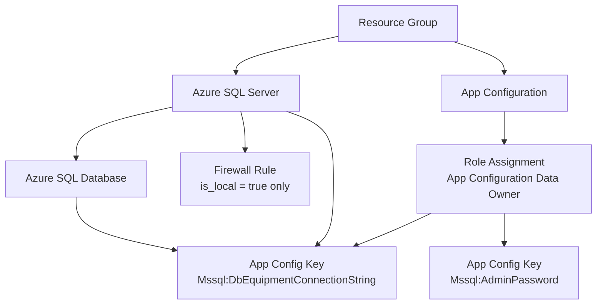

[← Back to README](../README.md)

# Cloud Infrastructure (IaC)

The `CloudInfrastructure/` directory contains [Terraform](https://www.terraform.io/) configuration that provisions the Azure resources required by this microservice.

> **Note:** This configuration provisions **data and configuration resources only** (SQL Server, database, App Configuration). Application hosting (e.g., App Service, Container Apps) is managed separately.

## Table of Contents

- [Provisioned Resources](#provisioned-resources)
- [Resource Diagram](#resource-diagram)
- [Prerequisites](#prerequisites)
- [Variables](#variables)
- [Usage](#usage)
- [Security Notes](#security-notes)

---

## Provisioned Resources

| Resource | Terraform Name | Purpose |
|----------|---------------|---------|
| Resource Group | `azurerm_resource_group.resource_group` | Container for all resources |
| Azure SQL Server | `azurerm_mssql_server.mssql_server` | Hosts the equipment database |
| Azure SQL Database | `azurerm_mssql_database.mssql_db_fleetmanagement_equipment` | `FleetManagement.Equipment` database (Free SKU) |
| SQL Firewall Rule | `azurerm_mssql_firewall_rule.allow_my_ip` | Allows local developer IP (only when `is_local = true`) |
| App Configuration | `azurerm_app_configuration.app_configuration` | Stores the connection string and SQL admin password |
| Role Assignment | `azurerm_role_assignment.appconf_data_owner` | Grants the deploying identity `App Configuration Data Owner` |
| App Config Key: password | `azurerm_app_configuration_key.mssql_password_key` | Stores the generated SQL admin password |
| App Config Key: conn string | `azurerm_app_configuration_key.mssql_connection_string` | Stores the full MSSQL connection string |

The SQL admin password is randomly generated on first apply and stored in both Terraform state and Azure App Configuration.

---

## Resource Diagram



---

## Prerequisites

- [Terraform](https://developer.hashicorp.com/terraform/install) ≥ 1.x installed
- [Azure CLI](https://learn.microsoft.com/en-us/cli/azure/install-azure-cli) installed and authenticated:
  ```bash
  az login
  ```
- An active Azure subscription
- The authenticated identity must have sufficient permissions:
  - `Contributor` (or scoped create permissions) to provision SQL Server, SQL Database, and App Configuration
  - `Microsoft.Authorization/roleAssignments/write` — required to assign the `App Configuration Data Owner` role. This typically requires `Owner` or `User Access Administrator` on the target scope.

---

## Variables

Defined in `variables.tf`:

| Variable | Type | Default | Description |
|----------|------|---------|-------------|
| `resource-suffix` | `string` | `fleetmanagement` | Suffix appended to all resource names. Must be **unique per deployment** — Azure SQL Server and App Configuration names are globally scoped. Override this per developer or environment to avoid naming conflicts. |
| `location-region` | `string` | `West Europe` | Azure region where all resources are created. |
| `is_local` | `bool` | `true` | When `true`, adds a firewall rule allowing your current public IP to connect to the SQL Server. Set to `false` in CI/CD pipelines — no local IP rule will be created, and additional network access must be configured separately if needed. |

---

## Usage

All commands should be run from the `CloudInfrastructure/` directory.

### 1. Initialize Terraform

```bash
cd CloudInfrastructure
terraform init
```

### 2. Review the Plan

```bash
terraform plan -var="resource-suffix=fleetmgmt-yourname"
```

> Always override `resource-suffix` with something unique to avoid conflicts with existing Azure resources.

### 3. Apply

```bash
terraform apply -var="resource-suffix=fleetmgmt-yourname"
```

For CI/CD pipelines, set `is_local = false` to skip adding the developer firewall rule:

```bash
terraform apply \
  -var="resource-suffix=fleetmgmt-prod" \
  -var="is_local=false"
```

### 4. Destroy

```bash
terraform destroy -var="resource-suffix=fleetmgmt-yourname"
```

---

## Security Notes

### Terraform State Contains Secrets
The generated SQL admin password and full connection string are written to `terraform.tfstate`. This file **must not be committed to source control** — verify it is covered by `.gitignore`.

For shared or production environments, configure a [remote backend](https://developer.hashicorp.com/terraform/language/settings/backends/configuration) (e.g., Azure Blob Storage with state locking) so state is stored securely and consistently across team members.

### App Configuration Keys Are Not Encrypted at Rest by Default
The `free` SKU of Azure App Configuration does not support customer-managed keys. For sensitive production workloads, consider upgrading to the `standard` SKU and enabling encryption.

### Firewall Rule Relies on External IP Detection
When `is_local = true`, Terraform fetches your current public IP from `https://ifconfig.me/ip` and adds it as a firewall rule. This can fail or produce incorrect results if:
- You are behind a VPN or corporate proxy
- Your egress IP changes between `plan` and `apply`

If you cannot connect after applying, verify the detected IP and re-run `terraform apply` to update the rule.

### RBAC Propagation Delay
Azure RBAC assignments can take up to a few minutes to propagate. If the App Configuration key creation fails immediately after the role assignment is created, simply re-run `terraform apply` — it is idempotent and will succeed once the role has propagated.
