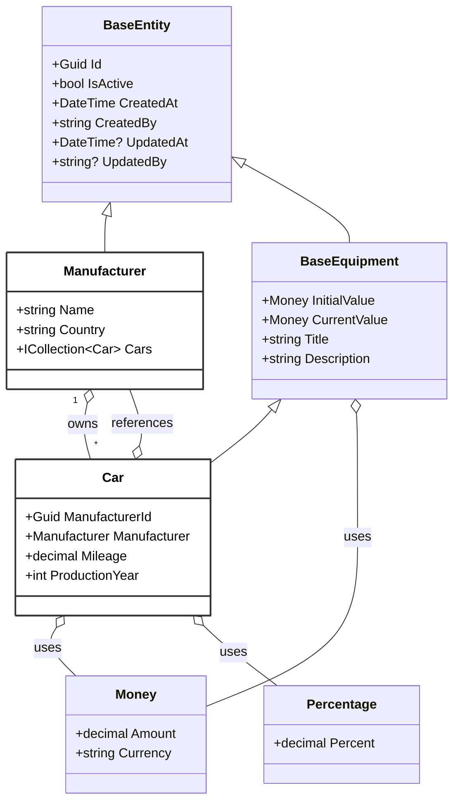

# FleetManagement.Equipment
Microservice for Fleet Management system


## Table of Contents

- [Domain Entities Overview](#domain-entities-overview)
- [Running Locally](#running-locally)
- [Database Migrations](#database-migrations)
## Domain Entities Overview

The following diagram presents the main domain entities and value objects in the solution. **Only `Car` and `Manufacturer` are persisted in the database**; the rest serve as abstractions or value objects to support the domain model.



**Legend:**
- <span style="background-color:#fff; color:#000; padding:2px 6px; border-radius:3px; border:1px solid #333;">White</span> = Entity persisted in the database
- Other classes are domain abstractions or value objects

## Running Locally

To run and test the application locally you need a running SQL Server instance. The easiest way is to use a container.

### Start SQL Server Container

**Docker:**
```bash
docker run -e "ACCEPT_EULA=Y" -e "MSSQL_SA_PASSWORD=MyPassword123!!" -e "MSSQL_PID=StandardDeveloper" -p 1433:1433 --name sql2025 --hostname sql2025 -d mcr.microsoft.com/mssql/server:2025-latest
```

**Podman:**
```bash
podman run -e "ACCEPT_EULA=Y" -e "MSSQL_SA_PASSWORD=MyPassword123!!" -e "MSSQL_PID=StandardDeveloper" -p 1433:1433 --name sql2025 --hostname sql2025 -d mcr.microsoft.com/mssql/server:2025-latest
```

### Configure Connection String

Once the container is running, set the connection string in `FleetManagement.Equipment.API/appsettings.Development.json`:

```json
{
  "ConnectionStrings": {
    "SqlDatabase": "Server=localhost,1433;Database=FleetManagement.Equipment;User Id=sa;Password=MyPassword123!!;Encrypt=True;TrustServerCertificate=True;"
  }
}
```

### Run the Application

```bash
dotnet run --project FleetManagement.Equipment.API/FleetManagement.Equipment.API.csproj
```

The application will automatically apply any pending migrations on startup.

---

## Database Migrations

### Prerequisites

- [.NET SDK](https://dotnet.microsoft.com/download) must be installed.
- The [EF Core Tools](https://learn.microsoft.com/en-us/ef/core/cli/dotnet) must be available. You can install them globally with:
	```
	dotnet tool install --global dotnet-ef
	```
- Ensure all project dependencies are restored:
	```
	dotnet restore
	```

### Local Development Configuration

For local development, make sure to configure the connection string in `FleetManagement.Equipment.API/appsettings.Development.json` under the `ConnectionStrings:SqlDatabase` section. This file should contain the correct settings for your local SQL Server instance.

### Creating a Migration

To create a new Entity Framework Core migration, use the following command:

```
dotnet ef migrations add InitialCreate -p .\FleetManagement.Equipment.Infrastructure\FleetManagement.Equipment.Infrastructure.csproj -s .\FleetManagement.Equipment.API\FleetManagement.Equipment.API.csproj
```

#### Why This Command?

This command is tailored for a solution where the Entity Framework Core DbContext is located in a different project (Infrastructure) than the startup project (API). This is a common pattern in clean architecture and DDD-based solutions, where separation of concerns is maintained between the API, domain, and infrastructure layers.

By specifying both the migration project (`-p`) and the startup project (`-s`), you ensure that:
- Migrations are added to the correct project (Infrastructure), which contains the `AppDbContext` and migration history.
- The application is started from the correct entry point (API), so all configuration (like dependency injection, appsettings, etc.) is loaded as it would be in production or development.

#### Command Breakdown

- `dotnet ef migrations add InitialCreate` — Adds a new migration named `InitialCreate`.
- `-p .\FleetManagement.Equipment.Infrastructure\FleetManagement.Equipment.Infrastructure.csproj` — Specifies the project where the migrations and DbContext are located (Infrastructure).
- `-s .\FleetManagement.Equipment.API\FleetManagement.Equipment.API.csproj` — Specifies the startup project to use for configuration and dependency injection (API).

This approach ensures migrations are generated with the correct context and configuration, avoiding issues with missing dependencies or misconfigured services.

### Apply Migration

To apply pending migrations to the database, run the following command from the solution root:

```
dotnet ef database update -p .\FleetManagement.Equipment.Infrastructure\FleetManagement.Equipment.Infrastructure.csproj -s .\FleetManagement.Equipment.API\FleetManagement.Equipment.API.csproj
```

#### Why This Command?

This command applies any pending Entity Framework Core migrations to the target database. It is useful when you want to create or update the database schema to match the current model defined in the Infrastructure project.

#### Command Breakdown

- `dotnet ef database update` — Applies any pending EF Core migrations to the target database, creating or updating tables, keys, indexes, and other schema elements.
- `-p .\FleetManagement.Equipment.Infrastructure\FleetManagement.Equipment.Infrastructure.csproj` — Specifies the project that contains the migrations and the `DbContext` (the Infrastructure project). Migrations will be read from this project.
- `-s .\FleetManagement.Equipment.API\FleetManagement.Equipment.API.csproj` — Specifies the startup project (the API project). The startup project is used to load application configuration, dependency injection, and any services required when constructing the `DbContext` (for example, the connection string).

This combination ensures EF Core applies migrations from the Infrastructure project while using the API project's runtime configuration and services to connect to the correct database.

After running the command, verify the database schema is updated and the migration history table (usually `__EFMigrationsHistory`) contains the applied migration entries.
