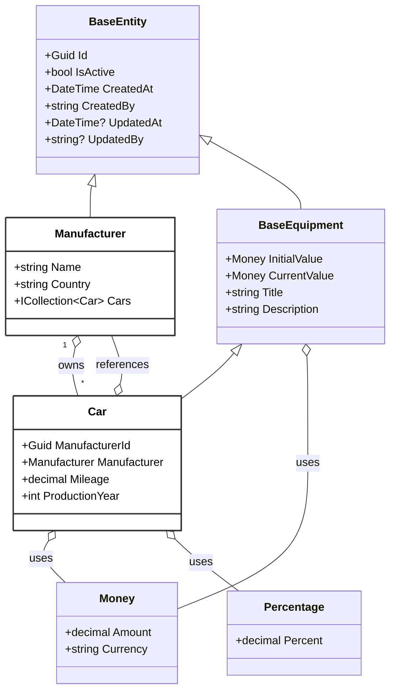

# FleetManagement.Equipment

Microservice for the Fleet Management system.

## Table of Contents

- [Domain Entities Overview](#domain-entities-overview)
- [Local Development & Database Setup](docs/database.md)
- [Cloud Infrastructure (IaC)](docs/infrastructure.md)
- [Containerization](docs/containerization.md)
- [Future Ideas & Enhancements](Docs/Ideas/README.md)

## Domain Entities Overview

The following diagram presents the main domain entities and value objects in the solution. **Only `Car` and `Manufacturer` are persisted in the database**; the rest serve as abstractions or value objects to support the domain model.

**Legend:**
- White = Entity persisted in the database
- Other classes are domain abstractions or value objects
